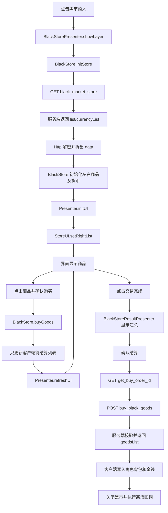

# 接口数据到界面显示流程（以 `buy_black_goods` 为例）

## 1. 先说结论

当前黑市功能实际上分成三段：

1. `black_market_store`：打开黑市时获取商品列表，这个接口的响应才会被整理并显示到商店界面。
2. 本地暂存交易：玩家点击“购买”后，客户端只修改 `BlackStore` 模型里的待结算列表和临时货币，不会立即请求服务器。
3. `buy_black_goods`：玩家点击“交易完成”并确认后，客户端才提交所有待购买商品。成功响应用于最终修改本地角色背包和金钱，然后关闭界面；它不是用于首次展示商品列表的接口。

新黑市链路的核心调用关系如下：



> 仓库中还保留了旧的 `Chapman` / `BlackStoreLayer` 黑市实现。本文分析的是会调用 `buy_black_goods` 的新实现：`BlackStorePresenter` + `app.models.Store.BlackStore`。

## 2. 相关文件与职责

| 层次 | 文件 | 主要职责 |
| --- | --- | --- |
| 黑市入口 | `fzjh_lua/assets/src/app/models/role/RoleObserveModel.lua:639` | 点击 `chapman` 类型 NPC 后打开黑市 Presenter |
| 黑市入口（另一处） | `fzjh_lua/assets/src/app/models/map/MapHandle/Modules/EMapModule/EMapResults.lua:136` | 从地图结果打开同一黑市 Presenter |
| 页面控制 | `fzjh_lua/assets/src/app/presenters/Store/BlackStorePresenter.lua` | 打开页面、组织左右列表、响应按钮和刷新 UI |
| 业务模型 | `fzjh_lua/assets/src/app/models/Store/BlackStore.lua` | 拉取商品、暂存买卖、校验背包和货币、发起结算 |
| 主商店 UI | `fzjh_lua/assets/src/app/views/ui/ActionUI/StoreUI.lua` | 把 Presenter 给出的列表写入实际控件 |
| 结算 Presenter | `fzjh_lua/assets/src/app/presenters/Store/BlackStoreResultPresenter.lua` | 展示买入、卖出和总价，触发最终结算 |
| 结算 UI | `fzjh_lua/assets/src/app/views/ui/BlackStoreUI/BlackStoreResultUI.lua` | 渲染结算清单 |
| HTTP 接口定义 | `fzjh_lua/assets/src/app/extends/HttpManager.lua:5051` | 定义 `buyBlackGoods` 请求 |
| HTTP 公共层 | `fzjh_lua/assets/src/app/extends/Http.lua` | JSON 编码、加密、签名、发送、验签、解密和回调分发 |
| 服务端分发 | `server.py:83` | 解码请求、匹配路由、调用 handler、封装响应 |
| 服务端协议 | `protocol.py` | 请求解密/解析、统一响应结构、响应加密和签名 |
| 黑市服务端 | `handlers/black_market.py` | 商品列表、日售出状态、订单幂等和购买参数校验 |
| 交易号服务端 | `handlers/basic.py:1609` | 生成 `get_buy_order_id` 的订单号 |

## 3. 打开界面：列表数据怎样显示出来

### 3.1 从 NPC 进入黑市

`RoleObserveModel.lua` 检测到 NPC 的 ID 包含 `chapman` 后执行：

```text
PopupLayerController:showLayer("BlackStorePresenter")
  -> presenter:setRole(User:getRole())
  -> presenter:showLayer()
```

交易完成后的回调还会刷新房间、移除当前黑市商人并刷新角色列表。

### 3.2 Presenter 请求初始化模型

`BlackStorePresenter:showLayer()` 调用：

```text
BlackStore:initStore(callback)
  -> HttpManagerEx:getMarketStoreList(...)
  -> GET black_market_store
```

只有在响应满足以下条件时才会继续显示页面：

- HTTP 状态为 `200`；
- 业务 `errcode == 0`；
- `data.status == "OPEN"`；
- `data.list` 存在。

服务端 `handlers/black_market.py:175` 返回的核心结构为：

```json
{
  "status": 0,
  "errcode": 0,
  "errmsg": "",
  "data": {
    "status": "OPEN",
    "list": [
      {
        "itemId": "qiannengdan",
        "name": "潜能丹",
        "price": 80000,
        "priceUnit": "money",
        "discount": 0
      }
    ],
    "currencyList": []
  }
}
```

`list` 会过滤掉当天已经购买过的商品；当前 mock 商品目录中每种商品每天只能购买一次。

### 3.3 HTTP 层如何把响应交给业务层

公共 HTTP 流程在 `app/extends/Http.lua` 中：

1. Lua table 先编码为 JSON。
2. 请求体按当前协议组 `FZJH03` 加密。
3. 请求附带 `userid`、`uuid`、`time`、`nonce`、`sig`、客户端版本等 header。
4. 收到响应后先用响应 header 和 `T_TOKEN` 校验签名。
5. 解密外层响应，再 `json.decode` 为 Lua table。
6. `createGetResponseFunction` 最终把参数拆成：

```lua
callback(status, errcode, errmsg, data, isEncrypted)
```

当前 mock 返回的是“外层加密、`data` 为普通对象”的响应，因此业务回调中的 `isEncrypted` 通常是 `nil`；`BlackStore:initStore` 只把明确的 `false` 当作非法响应。

### 3.4 模型把服务端字段转换成页面模型

`BlackStore:__initRightList(data.list)` 不会直接把服务端 table 交给 UI，而是拆成两部分：

- `_rightSellList`：实际在商人列表中流转的本地物品实例，包含唯一 `id`、`itemId` 和 `count`。
- `_goodsInfoList[itemId]`：服务端商品元数据，包含 `name`、`price`、`priceUnit` 和 `discount`。

然后 `BlackStore:getRightList()` 再把这两部分与本地物品配置合并成 Presenter 使用的列表项。

| 服务端字段/来源 | 模型中的用途 | 最终界面 |
| --- | --- | --- |
| `list[].itemId` | 查本地物品配置、生成物品实例 | 商品名称、描述及详情 |
| `list[].name` | 保存到 `_goodsInfoList` | 右侧商品名 `Text_name` |
| `list[].price` | 生成价格文本、结算时再次提交 | 价格 `Text_num` |
| `list[].priceUnit` | 决定货币类型及图标/文字 | 价格单位 |
| `list[].discount` | 生成 `isDazhe` 等显示状态 | 折扣图片和折扣文字 |
| `currencyList` | 初始化 `_currencyList` | 对应货币余额 |
| 本地 `role.money` | 总是加入临时货币列表 | 页面金钱 `Text_money` |

如果角色有 `fuhuiyin` 经脉印记，`__initGoodsPrice()` 还会在客户端重新计算 `yuanbao` 商品的价格。

### 3.5 Presenter 到实际控件

服务端列表准备好后，回调依次执行：

```text
BlackStorePresenter:initUI()
  -> __initRightList()
  -> BlackStore:getRightList()
  -> StoreUI:setRightList(list)
  -> StoreUI:__initPanelItem2(panel, itemInfo)
```

`StoreUI:setRightList` 会复用已有列表行；数量不足时克隆新的 `Panel_item2`，数量过多时移除多余行。每一行最终设置：

- `Text_name`：商品名；
- `Text_num`：价格；
- `Text_status`：商品状态；
- `Image_DaZhe`：折扣标记；
- 行点击回调：打开 `ShoppingDialogLayer`。

所以，“接口收到数据后显示列表”的最短调用链是：

```text
black_market_store 响应
-> Http:createGetResponseFunction
-> BlackStore:initStore
-> BlackStore:__initRightList
-> BlackStorePresenter:initUI
-> BlackStore:getRightList
-> StoreUI:setRightList
-> StoreUI:__initPanelItem2
-> Cocos UI 控件显示
```

## 4. 点击购买：为什么此时看不到 `buy_black_goods` 请求

点击右侧商品会打开 `ShoppingDialogLayer`。确认后执行：

```text
BlackStorePresenter 右侧行回调
  -> BlackStore:buyGoods(item, type, callback)
  -> __checkCanBuyGoods
  -> 更新四组临时列表
  -> 扣减临时货币
  -> callback
  -> BlackStorePresenter:refreshUI()
```

四组列表的含义如下：

| 列表 | 含义 |
| --- | --- |
| `_leftItems` | 玩家当前背包加上待购买商品，用于左侧预览 |
| `_leftSoldList` | 本次待卖出给商人的物品 |
| `_rightSellList` | 商人当前尚未被选购的商品 |
| `_rightSoldList` | 本次待从商人处购买的商品 |

这一阶段只是在客户端形成“待结算快照”：

- 不调用 `buy_black_goods`；
- 不立即写入角色真实背包；
- 不立即写入角色真实金钱；
- 通过 `refreshUI()` 重绘左右列表，因此玩家会立即看到商品移动和余额变化。

## 5. 点击“交易完成”：`buy_black_goods` 请求怎样产生

`BlackStorePresenter` 先打开 `BlackStoreResultPresenter`，显示：

- `getRoleBoughtItems()` 生成的买入清单；
- `getRoleSoldItems()` 生成的卖出清单；
- 本次支出和收入总额。

玩家再次确认后进入 `BlackStore:settlement()`。

### 5.1 特殊分支：只有卖出，没有购买

如果 `_rightSoldList` 为空，客户端会直接：

1. 从本地角色背包扣除待卖出的物品；
2. 把临时 money 写回角色；
3. 标记结算完成并关闭界面。

这个分支不会获取交易号，也不会调用 `buy_black_goods`。

### 5.2 正常购买分支

如果存在待购买商品，客户端先组装：

```lua
goodsList = {
    {
        itemId = item.itemId,
        number = item.count,
        price = goodsInfo.price,
        priceUnit = goodsInfo.priceUnit
    }
}

mark = {
    isDiscount = role 是否拥有 fuhuiyin,
    isFreeSingle = role 是否拥有 fulingyin
}
```

然后按顺序请求：

```text
TransCheck:getTransIdFromWeb
  -> GET get_buy_order_id
  -> 得到 order_id
  -> HttpManager:buyBlackGoods
  -> POST buy_black_goods
```

实际请求的明文 JSON 形态如下；发送到网络前还会被 HTTP 公共层加密：

```json
{
  "goodsInfo": [
    {
      "itemId": "qiannengdan",
      "number": 1,
      "price": 80000,
      "priceUnit": "money"
    }
  ],
  "client_trans_id": "order-51",
  "mark": {
    "isDiscount": false,
    "isFreeSingle": false
  }
}
```

`server.log` 中已有一次真实调用样例，其中一次提交了 `qiannengdan`、`jingxinwan` 和 `putizi1` 三件商品，说明客户端会把本次暂存的购买项合并成一个请求。

## 6. 服务端怎样处理 `buy_black_goods`

请求进入服务端后的通用链路为：

```text
server.Handler
  -> protocol.decode_request_body
  -> protocol.parse_request_json
  -> 路由匹配 POST buy_black_goods
  -> handlers.black_market.buy_black_goods(ctx)
  -> protocol.make_response
  -> 加密响应并附加签名 header
```

`handlers/black_market.py:188` 当前依次校验：

1. header 中必须存在 `userid`；
2. `client_trans_id` 必须存在；
3. `goodsInfo` 必须是非空列表，且不能超过商品目录大小；
4. 同一请求不能出现重复 `itemId`；
5. 商品必须存在于服务端固定商品目录；
6. `number` 必须严格等于 `1`；
7. 商品当天不能已经售出；
8. `price` 和 `priceUnit` 必须与服务端目录完全一致；
9. 同一交易号再次提交相同内容时返回缓存结果；同一交易号提交不同内容时报冲突。

全部通过后，服务端把商品标记为当天已售出，缓存本次响应并持久化状态，返回规范化后的 `goodsList`：

```json
{
  "status": 0,
  "errcode": 0,
  "errmsg": "",
  "data": {
    "goodsList": [
      {
        "itemId": "qiannengdan",
        "number": 1,
        "price": 80000,
        "priceUnit": "money"
      }
    ]
  }
}
```

## 7. `buy_black_goods` 响应怎样反馈到客户端和界面

`Http:createGetResponseFunction` 完成验签、解密和 JSON 解析后，调用 `BlackStore:settlement` 内注册的业务回调。

成功分支 `status == 200 and errcode == 0` 会：

1. 从角色真实背包移除 `_leftSoldList` 中本次卖出的物品；
2. 遍历服务端返回的 `data.goodsList`；
3. 对每项调用 `role:addItemCount(itemId, number)` 写入角色真实背包；
4. 如服务端返回某件 `yuanbao` 商品价格为 `0`，显示免费获得物品的提示；
5. 把临时货币列表中的 `money` 写回角色；
6. 设置本次结算完成状态；
7. Presenter 关闭主商店和结算页面；
8. 执行入口传入的结束回调，例如移除黑市商人、刷新房间和角色。

因此 `buy_black_goods` 成功响应本身通常不会再重绘商品列表：成功后界面直接关闭。只有商品状态冲突时才重新拉取并刷新列表。

### 错误分支

| `errcode` | 服务端含义 | 客户端行为 |
| --- | --- | --- |
| `1` | 商品列表/数量等参数非法 | 提示“请合法游戏”，把结算标记为结束并退出当前流程 |
| `2` | 商品已售出，或价格/单位与服务端不一致 | 提示商品列表已更新，重新请求 `black_market_store` 并调用 `refreshUI()` |
| `400` | 缺少交易号 | 显示服务端 `errmsg` |
| `409` | 相同交易号对应了不同请求内容 | 显示服务端 `errmsg` |
| `552` | 缺少 `userid` | 显示服务端 `errmsg` |
| 其他/网络错误 | HTTP、验签、解密或业务异常 | 由 HTTP 公共层和当前回调显示错误信息 |

## 8. 当前实现中值得注意的问题

以下是从现有 Lua、服务端实现和日志对照后发现的边界，并不影响理解主流程，但会影响以后扩展：

1. **服务端没有真正扣钱或发放物品。** 当前 handler 只校验商品、记录售出状态和保证订单幂等；角色背包与金钱最终由客户端 Lua 修改，之后依赖角色存档链路保存。
2. **服务端没有接收玩家卖出清单。** `buy_black_goods` 只提交购买项，卖出物品和卖出收入完全由客户端结算。
3. **`mark` 目前只参与幂等签名。** 服务端没有实现 `isDiscount` 和 `isFreeSingle` 对价格、免费商品的计算。
4. **折扣扩展可能产生价格冲突。** 客户端会根据 `fuhuiyin` 修改 `yuanbao` 价格，但服务端目前仍要求价格严格等于固定目录价；如果目录加入 `yuanbao` 商品，可能持续返回 `errcode == 2`。
5. **非 money 货币没有完整落账。** 购买阶段可以临时扣减多种 `_currencyList`，但成功结算时目前只把 `money` 写回角色。
6. **仅卖出流程绕过服务端。** 没有交易号、幂等或服务端合法性校验。
7. **结算锁是模块级变量。** `isSettlement` 不是某个 `BlackStore` 实例的字段；若同时存在多个实例，它们会共享结算状态。
8. **仓库/藏衣阁物品数量是异步补充。** `initStore` 发起玄兵洞和藏衣阁查询后没有等待它们完成再首次绘制，初次打开时“已拥有数量”可能短暂不完整。
9. **`errcode == 1` 会结束界面但不落账。** 用户可能只看到页面关闭，需要结合提示和日志判断实际并未购买成功。

如果目标是让 mock 更接近权威服务端，后续应优先补齐：服务端货币校验与扣减、物品入账、卖出清单校验、折扣/免费规则，以及由响应返回完整的资产变化结果；客户端再以服务端结果为准更新界面和角色数据。

## 9. 排查问题时的观察点

### 页面没有打开

依次确认：

```text
是否进入 BlackStorePresenter.showLayer
-> black_market_store 是否返回 HTTP 200 / errcode 0
-> data.status 是否为 OPEN
-> data.list 是否存在
-> 响应是否通过签名校验和解密
```

### 页面打开但商品为空

依次检查：

```text
服务端 _available_goods 是否仍有未售商品
-> BlackStore.__initRightList 是否写入 _rightSellList
-> BlackStore.getRightList 是否生成 view model
-> StoreUI.setRightList 是否创建/显示 Panel_item2
```

### 点击“购买”后抓不到请求

这是当前设计的正常行为。点击购买只更新客户端暂存状态；需要继续点击“交易完成”，并在结算弹窗再次确认，才会先请求 `get_buy_order_id`，再请求 `buy_black_goods`。

### 最终确认后没有发出 `buy_black_goods`

重点检查：

- `_rightSoldList` 是否为空；为空时会走“仅卖出”的本地结算分支；
- `get_buy_order_id` 是否成功返回 `order_id`；
- 是否已经被模块级 `isSettlement` 判定为结算完成；
- `goodsInfo` 中能否取得对应的 `_goodsInfoList[itemId]`；
- HTTP 公共层是否在签名、加密或请求发送阶段报错。

### 返回成功但角色未获得物品

重点检查 `data.goodsList` 是否为数组，字段名是否严格是 `itemId` 和 `number`，以及本地物品配置中是否存在对应 `itemId`。客户端最终依靠：

```lua
role:addItemCount(v.itemId, v.number)
```

完成真实背包变更。

### 返回 `errcode == 2`

对照请求和 `BLACK_MARKET_GOODS` 中同一商品的：

- `price`；
- `priceUnit`；
- 当日 `sold` 状态；
- 客户端是否因为经脉印记改写了价格。

该错误会触发重新获取 `black_market_store`，所以日志中通常会紧接着出现新的列表请求。

## 10. 一句话调用栈

```text
首次显示：
NPC -> BlackStorePresenter -> BlackStore.initStore -> black_market_store
-> HTTP 解密回调 -> 模型列表 -> Presenter -> StoreUI -> 控件

选择商品：
StoreUI 点击 -> ShoppingDialogLayer -> BlackStore.buyGoods
-> 本地暂存列表 -> Presenter.refreshUI -> StoreUI 重绘

最终结算：
交易完成 -> BlackStoreResultPresenter -> BlackStore.settlement
-> get_buy_order_id -> buy_black_goods -> 服务端校验/幂等
-> HTTP 解密回调 -> 角色背包/金钱 -> 关闭界面
```
